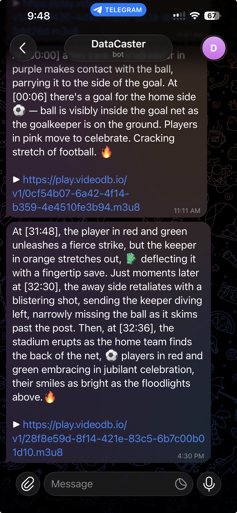

<p align="center">
  
</p>

<h1 align="center">DataCaster</h1>

<p align="center">
  <strong>One stream in, three sportsbook-grade products out.</strong><br/>
  Real-time event JSON · multimodal search · LLM-grounded Q&amp;A · 9:16 reels to Telegram.<br/>
  All powered by VideoDB.
</p>

<p align="center">
  <a href="https://youtu.be/lR99z0Jel-4">
    
  </a>
  <br/>
  <em>▶ Click to watch the 90-second demo on YouTube</em>
</p>

---

## What it is

DataCaster automates the football scouting workflow that Sportradar and Stats Perform run by hand. Point it at a YouTube VOD or a live RTSP/RTMP feed and one VideoDB pipeline emits four production surfaces:

1. **Structured event JSON** — every detected moment classified (goal, save, card, corner, …) with confidence + team labels, persisted by `video_id` to a bind-mounted SQLite cache, streamed to subscribers over Server-Sent Events.
2. **Multimodal search** — `video.search` exposes per-tab modes: **visual** (scene index), **transcript** (`video.index_spoken_words`), and **audio** (RTStream only).
3. **LLM-driven Ask** — rewrite → multi-rail search → compose. `coll.generate_text(model_name="ultra")` rewrites the question into concrete search phrases, fans them across scene + spoken-word indexes in parallel, and composes a scout-grade answer with inline `[MM:SS]` citations.
4. **Programmable editing → Telegram** — one-click 9:16 highlight reel from the most-recent N events. Composed via VideoDB Timeline at platform-ready resolution (608×1080), paired with a `coll.generate_text` prose recap, delivered to Telegram via Bot API.

<p align="center">
  
  <br/>
  <em>9:16 reel + auto-generated recap caption posted to Telegram from the Reel button.</em>
</p>

Two classifier modes ship: **football** (12-event vocab — default) and **describe** (generic scene-description for podcasts, demos).

---

## Architecture at a glance

```
   YouTube VOD / RTSP URL          ┌─────────────────────────────────┐
 ──────────────────────────▶  │       VideoDB collection        │
                              │   coll.upload(media_type=video) │
                              │   video.index_scenes(prompt)    │
                              │   video.index_spoken_words      │
                              └─────────────┬───────────────────┘
                                            ▼
                               poll_scene_index_forever
                                            ▼
                  ┌──────────────────────┬──────────────────────┐
                  ▼                      ▼                      ▼
          ┌──────────────────┐ ┌─────────────────────┐ ┌──────────────────────┐
          │ Structured event │ │  Multimodal search  │ │  LLM-driven Ask +    │
          │ feed (SSE/JSON)  │ │  visual + transcript│ │  Telegram reel       │
          └──────────────────┘ └─────────────────────┘ └──────────────────────┘
```

- **Backend** — FastAPI with async workers (VOD scene-poller, JSONL tailer for RTStream, commentary worker, highlight indexer)
- **Frontend** — React 18 + Vite + TypeScript + Tailwind v4 + shadcn/ui
- **Persistence** — SQLite at `./datacaster.db`, bind-mounted into the backend container so the per-`video_id` event cache survives every `make rebuild`
- **Sandbox** — registered in a sidecar file; released on `/api/end_session`, lifespan shutdown, SIGTERM, and startup orphan sweep

For the longer version, see [`docs/ARCHITECTURE.md`](docs/ARCHITECTURE.md).

---

## Repository layout

```
DataCaster/
├── backend/             FastAPI app
│   ├── main.py            entry point, lifespan workers + sandbox sweep
│   ├── pipeline.py        VideoDB connection + sandbox + RTStream + indexes
│   ├── vod.py             VOD scene-poll worker (resume-aware)
│   ├── classifier.py      JSONL tailer for RTStream
│   ├── search.py          LLM-driven Ask + multimodal search routing
│   ├── commentary.py      generate_voice + autonomous commentary worker
│   ├── highlights.py      Timeline composer (highlights + 9:16 reels)
│   ├── telegram.py        Bot API delivery client
│   ├── sandbox.py         sidecar-tracked orphan sweeper
│   ├── prompts.py         VISUAL_FOOTBALL / VISUAL_DESCRIBE / commentary
│   ├── db.py              aiosqlite (events, commentary, highlights)
│   ├── events_bus.py      in-process pub/sub for SSE fanout
│   ├── source.py          file/url/youtube dispatcher (+ reuse fast path)
│   ├── config.py          runtime config
│   ├── bootstrap.py       dotenv + SIGTERM handler (must import first)
│   └── routes/            FastAPI routers
├── frontend/            React 18 + Vite + TypeScript + Tailwind v4
├── scripts/             helper scripts (ws_listener, sandbox utilities)
├── docs/                ARCHITECTURE / API / OPERATIONS / SANDBOX / …
├── docker-compose.yml   bind-mounts ./datacaster.db
├── Makefile             convenience targets (up, down, rebuild, logs, …)
├── requirements.txt     hackathon-branch videodb + FastAPI + workers
└── test-datacaster.py   end-to-end test runner (7 phases)
```

---

## Quickstart (Docker — recommended)

**Prerequisites:** Docker Desktop, a VideoDB API key (get one at [console.videodb.io](https://console.videodb.io)).

```bash
git clone https://github.com/sahil-sharma-50/DataCaster.git
cd DataCaster

cp .env.example .env
# Edit .env and set VIDEO_DB_API_KEY=...
# Optional: TELEGRAM_BOT_TOKEN + TELEGRAM_CHAT_ID for reel delivery

docker compose up -d
# → http://localhost:3000   (frontend)
# → http://localhost:8000   (backend API)
```

That's it. Two containers (frontend + backend). The Makefile wraps the common operations:

```bash
make up         # docker compose up -d
make logs       # tail both services
make rebuild    # no-cache rebuild + restart (use after code changes)
make down       # stop everything
make smoke      # quick health check
```

Open http://localhost:3000, pick a source (YouTube VOD or live RTSP/RTMP URL), click **Start**, and watch events stream in.

`./datacaster.db` is bind-mounted into the backend, so cached events survive every rebuild. Click **Resync** in the UI to force a fresh classification, or delete `./datacaster.db` to wipe everything.

## Quickstart (local dev, no Docker)

```bash
# Backend (terminal 1)
python3 -m venv .venv
source .venv/bin/activate
pip install -r requirements.txt
cp .env.example .env  # set VIDEO_DB_API_KEY
uvicorn backend.main:app --reload                         # → :8000

# Frontend (terminal 2)
cd frontend && npm install && npm run dev                 # → :3000 with /api proxied to :8000
```

---

## Configuration

Set in `.env` — see `.env.example` for the full template.

| Variable | Default | What it does |
|---|---|---|
| `VIDEO_DB_API_KEY` | required | Your VideoDB API key |
| `USE_SANDBOX` | `false` | When `true`, allocates a hackathon sandbox per session and routes voice + LLM through `model_name="ultra"`. When `false`, falls back to VideoDB free-tier defaults + `model_name="basic"`. |
| `SANDBOX_TIER` | `medium` | `small` ($1/hr, 4 slots) or `medium` ($3.50/hr, 3 slots). Small is more reliable on the hackathon infra. |
| `VISUAL_MODEL` | `google/gemma-4-31B-it` | RTStream-only — model for `rt.index_visuals`. VOD `video.index_scenes` uses VideoDB's default model. |
| `AUDIO_MODEL` | `Qwen/Qwen3.5-9B` | RTStream-only — model for `rt.index_audio`. |
| `VOICE_MODEL` | `k2-fsa/OmniVoice` | TTS for commentary, sandbox-routed via `coll.generate_voice`. |
| `TELEGRAM_BOT_TOKEN` | unset | Bot token from @BotFather. Required for reel delivery. |
| `TELEGRAM_CHAT_ID` | unset | Numeric chat id (DM @userinfobot to find it). |

---

## Testing

End-to-end test runner exercises every public surface across seven phases.

```bash
python test-datacaster.py --phase A      # idle assertions (<10s, no API spend)
python test-datacaster.py --phase B      # football VOD run (~4 min, paid)
python test-datacaster.py --phase C      # describe-mode VOD run (~3 min)
python test-datacaster.py --phase D      # frontend bundle reachability
python test-datacaster.py --phase E      # live RTStream ingest (~3 min)
python test-datacaster.py --phase F      # Telegram delivery probe (~5s)
python test-datacaster.py --phase G      # sandbox lifecycle (~30s+)
python test-datacaster.py                # full run (~16 min)
```

Phase F's `T29` (live `sendMessage`) is gated behind `DATACASTER_TELEGRAM_LIVE=1` so test runs don't spam the chat. Set the flag for an actual end-to-end smoke.

---

## Documentation

| Doc | What's in it |
|---|---|
| [`docs/ARCHITECTURE.md`](docs/ARCHITECTURE.md) | System shape, data flow, pipeline lifecycle, every VideoDB primitive used |
| [`docs/API.md`](docs/API.md) | Reference for every `/api/*` endpoint (request payloads, response shapes, SSE message types) |
| [`docs/OPERATIONS.md`](docs/OPERATIONS.md) | Day-to-day operations: knobs, state files, persistence, pre-submission checklist |
| [`docs/CLASSIFIER_TUNING.md`](docs/CLASSIFIER_TUNING.md) | The classifier prompt + threshold config |
| [`docs/TROUBLESHOOTING.md`](docs/TROUBLESHOOTING.md) | Symptom-first playbook for sandbox / classifier / Ask failures |
| [`docs/SANDBOX.md`](docs/SANDBOX.md) | VideoDB hackathon SDK reference (install, lifecycle, models, every workload API) |
| [`docs/DEMO_SCRIPT.md`](docs/DEMO_SCRIPT.md) | 90-second screenplay for the submission video |
| [`SUBMISSION.md`](SUBMISSION.md) | Hackathon submission entry — 200-word description + primitive checklist |

---

## VideoDB primitives used

| Primitive | Where |
|---|---|
| `coll.upload(url, media_type="video")` | `backend/source.py` |
| `coll.get_video(id)` | `backend/source.py` (reuse fast path) |
| `coll.get_videos()` | `backend/routes/lifecycle.py` (catalog dropdown) |
| `coll.connect_rtstream(...)` + `rt.index_visuals` + `rt.index_audio` + `rt.start_transcript` | `backend/pipeline.py` |
| `video.index_scenes(extraction_type=time_based, prompt=…)` | `backend/pipeline.py` |
| `video.index_spoken_words(force=True)` | `backend/pipeline.py` |
| `video.get_scene_index(id)` | `backend/vod.py` (poll loop) |
| `video.delete_scene_index(id)` | `backend/pipeline.py` (Resync) |
| `video.generate_stream()` | `backend/pipeline.py` |
| `video.search(query, search_type=semantic, index_type=scene\|spoken_word)` | `backend/search.py`, `backend/highlights.py` |
| `coll.search(namespace="rtstream", index_type=scene\|audio\|spoken_word)` | `backend/search.py` (live path) |
| `coll.generate_text(prompt, model_name="basic"\|"ultra")` | `backend/search.py`, `backend/highlights.py`, `backend/commentary.py` |
| `coll.generate_voice(text, model_name="k2-fsa/OmniVoice", sandbox_id, config)` | `backend/commentary.py` |
| `Timeline + VideoAsset + Track + generate_stream()` | `backend/highlights.py` (highlights + 9:16 reels) |
| `conn.create_sandbox(tier)` lifecycle | `backend/pipeline.py` (with sidecar tracking) |
| `conn.get_sandbox(id).stop()` | `backend/sandbox.py` (orphan sweeper) |

---

## Limitations

- **VOD path** — first events appear ~3-6 minutes after Start on the default model. Re-running a previously-classified video is **instant rehydrate** from the bind-mounted DB.
- **RTStream path** — time-to-first-event is ~30 seconds. VideoDB rejects localhost URLs; public-reachable feeds only. The bundled preset uses VideoDB's public sample feed.
- **Live YouTube URLs do NOT work** — neither `coll.upload` nor `coll.connect_rtstream` accepts a YouTube live URL. Wait for the VOD or use a real RTSP/RTMP feed.
- **Free-tier voice cap** — OmniVoice trips after ~3 commentary clips, then the worker enters a 5-minute backoff. Script-only fallback persists for after-the-fact reading.
- **Audio search is RTStream-only** — VOD has scene + spoken_word indexes but no audio search; the UI hides the audio tab on VOD sources.
- **Sandbox provisioning is intermittent** — medium-tier occasionally times out the 300s `wait_for_ready` budget. Small-tier is more reliable. Startup sweeper auto-cleans orphans.

---

Built solo for the **VideoDB Global Online Hackathon**, May 2026.
